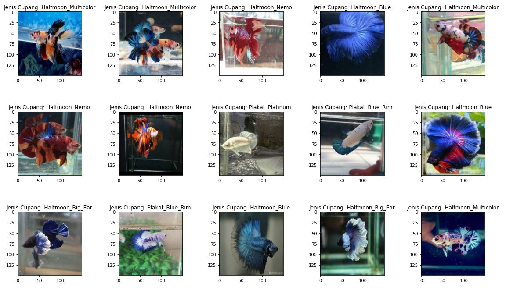
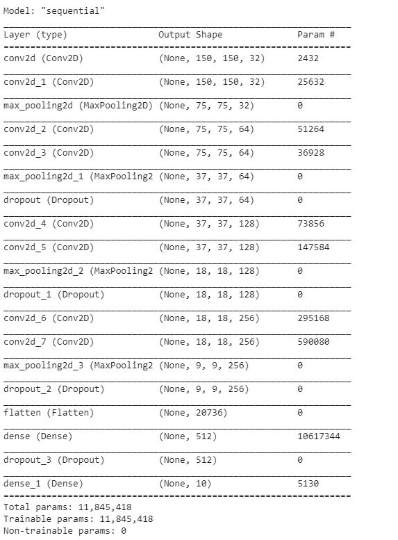
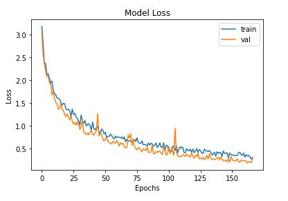
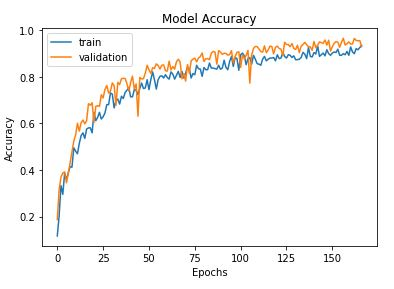
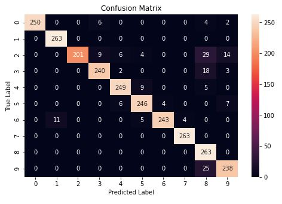
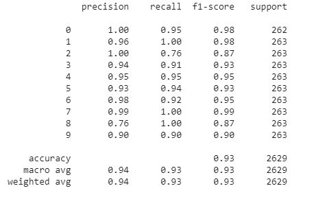
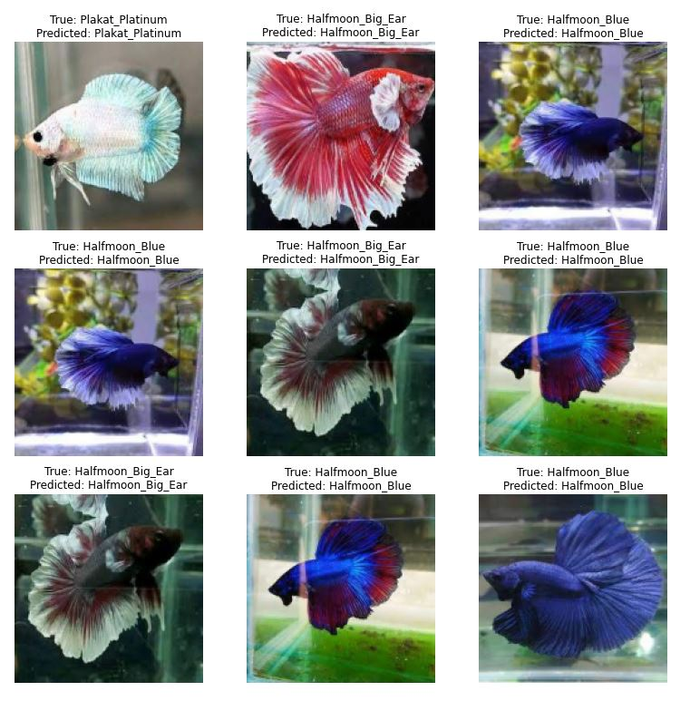

# bettaFish_TensorflowLite
Classify 10 types of betta fish with tensorflow, Dataset consists of 10 species of betta fish taken and crawled from google images or you can simply download at my dropbox here: https://dl.dropbox.com/s/24shsjf988eizki/dataset_cupang.zip?dl=2

# Random Sample of Images

# CNN Model Summary

# Plot Loss & Accuracy
Loss plot : 

Accuracy plot : 

# Model Evaluation 
Confusion Matrix : 

Precision, Recall, F1-Score & Support : 

# Model Prediction Results

